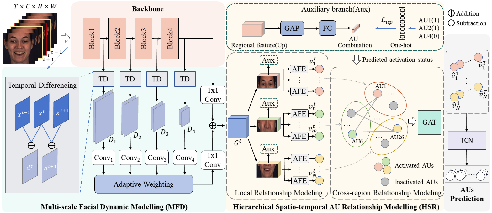
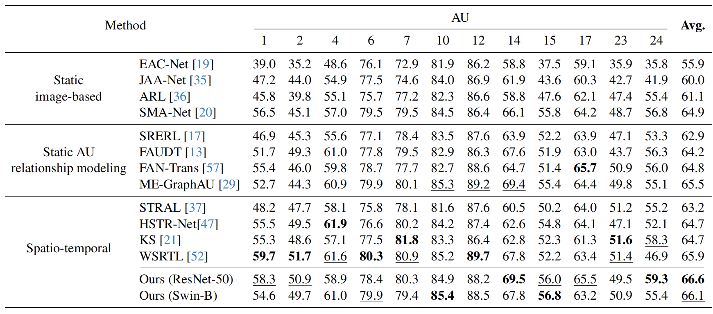
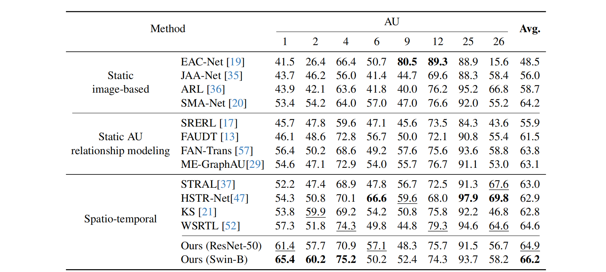

# \[CVPR2024\]
# Multi-Scale Dynamic and Hierarchical Relationship Modeling for Facial Action Units Recognition

This is an official release of the [Paper](https://arxiv.org/abs/2404.06443).

## Overview:


## Requirements
- Python3
- PyTorch

```bash
pip install -r requirements.txt
```
## Training
```bash
python train.py --backbone resnet --fold 1 --dataset_path /path/to/BP4D_dataset/ 
```
## Testing
```bash
python test_BP4D.py --backbone resnet --fold 1 --dataset_path /path/to/BP4D_dataset/ --resume /path/to/best_model_fold1.pth --evaluate
```

## results
BP4D


DISFA


## Citation
if the code or method help you in the research, please cite the following paper:
```bash
@article{wang2024multi,
  title={Multi-scale Dynamic and Hierarchical Relationship Modeling for Facial Action Units Recognition},
  author={Wang, Zihan and Song, Siyang and Luo, Cheng and Deng, Songhe and Xie, Weicheng and Shen, Linlin},
  journal={arXiv preprint arXiv:2404.06443},
  year={2024}
}

@inproceedings{wang2023spatial,
  title={Spatial-temporal graph-based AU relationship learning for facial action unit detection},
  author={Wang, Zihan and Song, Siyang and Luo, Cheng and Zhou, Yuzhi and Wu, Shiling and Xie, Weicheng and Shen, Linlin},
  booktitle={Proceedings of the IEEE/CVF Conference on Computer Vision and Pattern Recognition},
  pages={5899--5907},
  year={2023}
}

@inproceedings{luo2022learning,
  title     = {Learning Multi-dimensional Edge Feature-based AU Relation Graph for Facial Action Unit Recognition},
  author    = {Luo, Cheng and Song, Siyang and Xie, Weicheng and Shen, Linlin and Gunes, Hatice},
  booktitle = {Proceedings of the Thirty-First International Joint Conference on
               Artificial Intelligence, {IJCAI-22}},
  pages     = {1239--1246},
  year      = {2022}
}
```
## Acknowledgements
This repo is built using components from  [ME-GraphAU](https://github.com/CVI-SZU/ME-GraphAU)

